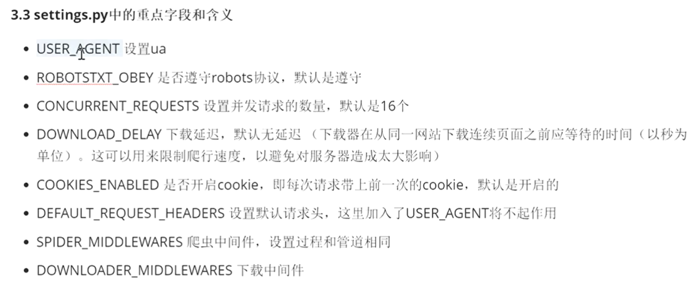
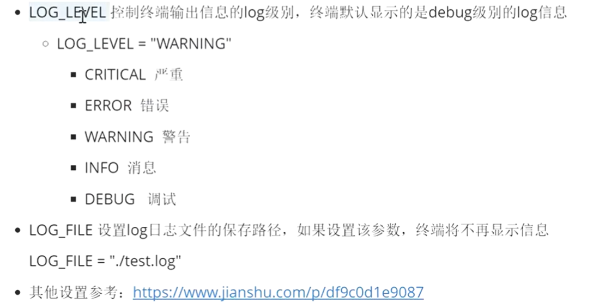

# scrapy基本使用及配置

```
文件说明:
scrapy.cfg: 项目的配置文件。
mySpider/: 项目的Python模块，将会从这里引用代码。
mySpider/items.py: 项目的目标文件。
mySpider/pipelines.py: 项目的管道文件。
mySpider/settings.py: 项目的设置文件。
mySpider/spiders/: 存储爬虫代码目录。
```

```
scrapy startproject '爬虫名'  # 创建scrapy项目
scrapy crawl '爬虫名'  # 运行项目
scrapy crawl '爬虫名' -o 文件名.csv  # 将爬取的内容存储到文件内, 未使用管道
```

```python
# 测试爬虫属性的使用
def parse(self, response):
    # 获取解析后的页面源代码
    print(response.text)
    bytes
    print(response.body)
    # 获取响应的url地址
    print(response.request.url)
    # 获取响应头
    print(response.headers)
    # 获取响应的请求头
    print(response.request.headers)
    # 响应状态码
    print(response.status)
```

+ 临时使用scrapy调试, 不需要创建项目, 直接在控制台使用
scrapy shell 网址

## settings.py配置信息


参考链接: [settings配置信息](https://www.jianshu.com/p/df9c0d1e9087)