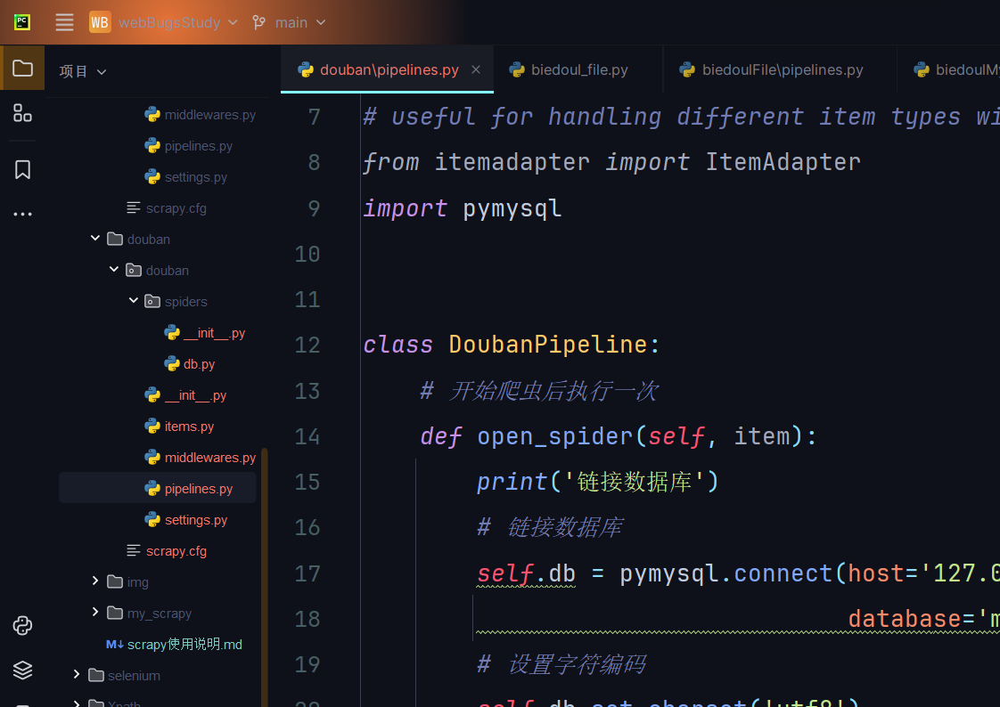

# scrapy基本使用及配置

```
文件说明:
scrapy.cfg: 项目的配置文件。
mySpider/: 项目的Python模块，将会从这里引用代码。
mySpider/items.py: 项目的目标文件。
mySpider/pipelines.py: 项目的管道文件。
mySpider/settings.py: 项目的设置文件。
mySpider/spiders/: 存储爬虫代码目录。
```

## 创建项目
```
scrapy startproject '爬虫名'  # 创建scrapy项目
scrapy crawl '爬虫名'  # 运行项目
scrapy crawl '爬虫名' -o 文件名.csv  # 将爬取的内容存储到文件内, 未使用管道
```

```python
# 测试爬虫属性的使用
def parse(self, response):
    # 获取解析后的页面源代码
    print(response.text)
    bytes
    print(response.body)
    # 获取响应的url地址
    print(response.request.url)
    # 获取响应头
    print(response.headers)
    # 获取响应的请求头
    print(response.request.headers)
    # 响应状态码
    print(response.status)
```

+ 临时使用scrapy调试, 不需要创建项目, 直接在控制台使用
scrapy shell 网址

## settings.py配置信息


参考链接: [settings配置信息](https://www.jianshu.com/p/df9c0d1e9087)
```python
# 推荐配置, 可直接食用
ROBOTSTXT_OBEY = False  # 是否遵循爬虫协议
LOG_LEVEL = 'ERROR'  # 控制台只打印报错信息
DEFAULT_REQUEST_HEADERS = { ## 请求头
	"Accept": "text/html,application/xhtml+xml,application/xml;q=0.9,*/*;q=0.8",
	"Accept-Language": "en",
	'User-Agent':
		'Mozilla/5.0 (Windows NT 10.0; Win64; x64) AppleWebKit/537.36 (KHTML, like Gecko) '
		'Chrome/119.0.0.0 Safari/537.36'
}

# 将获取的数据同时存储到数据库和文件内
# 在管道文件内, 添加多个类, 在配置文件中开启配置
ITEM_PIPELINES = {  # 使用scrapy管道
	"douban.pipelines.DoubanPipeline": 300,  # 优先级最高
	"douban.pipelines.DoubanfilePipeline": 400,  # 优先级最低
}
```
同时存储到文件案例



## setting.py配置cookies
```python
# Disable cookies (enabled by default)
COOKIES_ENABLED = False  # 使用settings配置内的cookies
# 直接在header中添加cookies
DEFAULT_REQUEST_HEADERS = {
	"Accept": "text/html,application/xhtml+xml,application/xml;q=0.9,*/*;q=0.8",
	"Accept-Language": "en",
	'User-Agent':
		'Mozilla/5.0 (Windows NT 10.0; Win64; x64) AppleWebKit/537.36 (KHTML, like Gecko) '
		'Chrome/120.0.0.0 Safari/537.36',
	'Cookie':
		'GUID=a36cdad4-a856-4702-8f24-291cf21ba5cb; c_channel=0; c_csc=web; accessToken=avatarUrl%3Dhttps%253A%252F%252Fcdn.static.17k.com%252Fuser%252Favatar%252F15%252F95%252F09%252F102430995.jpg-88x88%253Fv%253D1698931480000%26id%3D102430995%26nickname%3D%25E7%25A5%259E%25E5%25A5%2587%25E7%259A%2584%25E9%2598%25BF%25E6%25A2%25A6%26e%3D1714909208%26s%3D43480568185e8682; sensorsdata2015jssdkcross=%7B%22distinct_id%22%3A%22102430995%22%2C%22%24device_id%22%3A%2218b9031fce35db-038e785c19353b-26031151-1327104-18b9031fce479e%22%2C%22props%22%3A%7B%22%24latest_traffic_source_type%22%3A%22%E7%9B%B4%E6%8E%A5%E6%B5%81%E9%87%8F%22%2C%22%24latest_referrer%22%3A%22%22%2C%22%24latest_referrer_host%22%3A%22%22%2C%22%24latest_search_keyword%22%3A%22%E6%9C%AA%E5%8F%96%E5%88%B0%E5%80%BC_%E7%9B%B4%E6%8E%A5%E6%89%93%E5%BC%80%22%7D%2C%22first_id%22%3A%22a36cdad4-a856-4702-8f24-291cf21ba5cb%22%7D; Hm_lvt_9793f42b498361373512340937deb2a0=1699356351,1700623243,1701942606; Hm_lpvt_9793f42b498361373512340937deb2a0=1701947940'
}
```

## items.py 定义要存储的字段

```python
class BiedoulfileItem(scrapy.Item):
    # define the fields for your item here like:
    # name = scrapy.Field()
    # 定义要存储的字段 定义title, con, 只能存储这两个字段, 存入其它则报错
    title = scrapy.Field()
    con = scrapy.Field()
```

## piplines.py 管道
+ 默认是关闭状态, 需要在settings里开启
+ 管道需要开启和关闭, 在piplines.py中定义开启函数和关闭函数
```python
class BiedoulmysqlPipeline:
	# 开启爬虫的时候执行一次
	def open_spider(self, item):
		pass

	# 实现对item对象数据的处理
	def process_item(self, item, spider):
		return item

	# 关闭爬虫的时候执行一次
	def close_spider(self, item):
		pass
```


